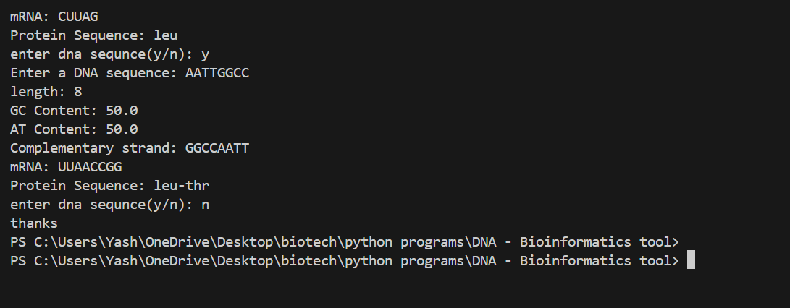

Markdown

# DNA Bioinformatics Tool

A python-based bioinformatics tool that analyzes DNA
sequence and simulates the central dogma of molecular
biology.

## Why I built this
This is my first bioinformatics project, built to 
start developing a portfolio in computational biology. 
I chose this because I understand the biology behind 
it deeply — DNA replication, transcription, and 
translation.

## Who is this for
Anyone who wants to explore what protein a DNA 
sequence codes for, or understand its basic 
properties like GC content and nucleotide composition.

## Features
- DNA sequence validation
- Length calculation
- Base counting
- GC and AT content calculation 
-  Antiparallel Complementary DNA strand
- DNA - mRNA transcription - protein translation
- complete codon table
- identify start/stop codon
- multiple sequence analyzes
- save results to .txt file

## How to run
python main_code.py

## Example output

## Future improvements 
- FASTA file support
- Data visualization
- GUI version
